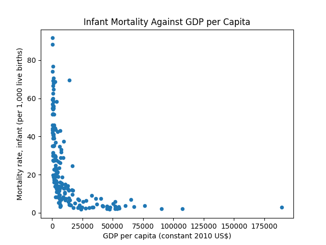

Describe Polar DF:
shape: (9, 130)
┌───────────┬───────────┬───────────┬───────────┬───┬───────────┬───────────┬───────────┬──────────┐
│ statistic ┆ Country   ┆ Adolescen ┆ Antiretro ┆ … ┆ Women who ┆ Women who ┆ Women who ┆ Women's  │
│ ---       ┆ Name      ┆ t         ┆ viral     ┆   ┆ believe a ┆ were      ┆ were      ┆ share of │
│ str       ┆ ---       ┆ fertility ┆ therapy   ┆   ┆ husband   ┆ first     ┆ first     ┆ populati │
│           ┆ str       ┆ rate      ┆ coverag…  ┆   ┆ is…       ┆ married   ┆ married   ┆ on ag…   │
│           ┆           ┆ (bir…     ┆ ---       ┆   ┆ ---       ┆ b…        ┆ b…        ┆ ---      │
│           ┆           ┆ ---       ┆ f64       ┆   ┆ f64       ┆ ---       ┆ ---       ┆ f64      │
│           ┆           ┆ f64       ┆           ┆   ┆           ┆ f64       ┆ f64       ┆          │
╞═══════════╪═══════════╪═══════════╪═══════════╪═══╪═══════════╪═══════════╪═══════════╪══════════╡
│ count     ┆ 217       ┆ 194.0     ┆ 96.0      ┆ … ┆ 7.0       ┆ 19.0      ┆ 19.0      ┆ 134.0    │
│ null_coun ┆ 0         ┆ 23.0      ┆ 121.0     ┆ … ┆ 210.0     ┆ 198.0     ┆ 198.0     ┆ 83.0     │
│ t         ┆           ┆           ┆           ┆   ┆           ┆           ┆           ┆          │
│ mean      ┆ null      ┆ 47.790116 ┆ 63.625    ┆ … ┆ 22.857143 ┆ 7.921053  ┆ 29.968421 ┆ 40.26044 │
│           ┆           ┆           ┆           ┆   ┆           ┆           ┆           ┆ 8        │
│ std       ┆ null      ┆ 40.455423 ┆ 27.365076 ┆ … ┆ 17.417985 ┆ 7.45159   ┆ 15.310782 ┆ 16.42678 │
│           ┆           ┆           ┆           ┆   ┆           ┆           ┆           ┆ 9        │
│ min       ┆ Afghanist ┆ 0.2928    ┆ 6.0       ┆ … ┆ 1.1       ┆ 0.2       ┆ 6.8       ┆ 9.4      │
│           ┆ an        ┆           ┆           ┆   ┆           ┆           ┆           ┆          │
│ 25%       ┆ null      ┆ 14.0274   ┆ 46.0      ┆ … ┆ 14.5      ┆ 3.7       ┆ 21.5      ┆ 28.4     │
│ 50%       ┆ null      ┆ 38.4744   ┆ 70.0      ┆ … ┆ 24.4      ┆ 5.6       ┆ 27.3      ┆ 35.4     │
│ 75%       ┆ null      ┆ 70.399    ┆ 86.0      ┆ … ┆ 40.6      ┆ 9.0       ┆ 37.0      ┆ 58.1     │
│ max       ┆ Zimbabwe  ┆ 196.034   ┆ 95.0      ┆ … ┆ 43.6      ┆ 29.7      ┆ 66.9      ┆ 72.6     │
└───────────┴───────────┴───────────┴───────────┴───┴───────────┴───────────┴───────────┴──────────┘

Describe Polar DF:
shape: (9, 130)
┌───────────┬───────────┬───────────┬───────────┬───┬───────────┬───────────┬───────────┬──────────┐
│ statistic ┆ Country   ┆ Adolescen ┆ Antiretro ┆ … ┆ Women who ┆ Women who ┆ Women who ┆ Women's  │
│ ---       ┆ Name      ┆ t         ┆ viral     ┆   ┆ believe a ┆ were      ┆ were      ┆ share of │
│ str       ┆ ---       ┆ fertility ┆ therapy   ┆   ┆ husband   ┆ first     ┆ first     ┆ populati │
│           ┆ str       ┆ rate      ┆ coverag…  ┆   ┆ is…       ┆ married   ┆ married   ┆ on ag…   │
│           ┆           ┆ (bir…     ┆ ---       ┆   ┆ ---       ┆ b…        ┆ b…        ┆ ---      │
│           ┆           ┆ ---       ┆ f64       ┆   ┆ f64       ┆ ---       ┆ ---       ┆ f64      │
│           ┆           ┆ f64       ┆           ┆   ┆           ┆ f64       ┆ f64       ┆          │
╞═══════════╪═══════════╪═══════════╪═══════════╪═══╪═══════════╪═══════════╪═══════════╪══════════╡
│ count     ┆ 217       ┆ 194.0     ┆ 96.0      ┆ … ┆ 7.0       ┆ 19.0      ┆ 19.0      ┆ 134.0    │
│ null_coun ┆ 0         ┆ 23.0      ┆ 121.0     ┆ … ┆ 210.0     ┆ 198.0     ┆ 198.0     ┆ 83.0     │
│ t         ┆           ┆           ┆           ┆   ┆           ┆           ┆           ┆          │
│ mean      ┆ null      ┆ 47.790116 ┆ 63.625    ┆ … ┆ 22.857143 ┆ 7.921053  ┆ 29.968421 ┆ 40.26044 │
│           ┆           ┆           ┆           ┆   ┆           ┆           ┆           ┆ 8        │
│ std       ┆ null      ┆ 40.455423 ┆ 27.365076 ┆ … ┆ 17.417985 ┆ 7.45159   ┆ 15.310782 ┆ 16.42678 │
│           ┆           ┆           ┆           ┆   ┆           ┆           ┆           ┆ 9        │
│ min       ┆ Afghanist ┆ 0.2928    ┆ 6.0       ┆ … ┆ 1.1       ┆ 0.2       ┆ 6.8       ┆ 9.4      │
│           ┆ an        ┆           ┆           ┆   ┆           ┆           ┆           ┆          │
│ 25%       ┆ null      ┆ 14.0274   ┆ 46.0      ┆ … ┆ 14.5      ┆ 3.7       ┆ 21.5      ┆ 28.4     │
│ 50%       ┆ null      ┆ 38.4744   ┆ 70.0      ┆ … ┆ 24.4      ┆ 5.6       ┆ 27.3      ┆ 35.4     │
│ 75%       ┆ null      ┆ 70.399    ┆ 86.0      ┆ … ┆ 40.6      ┆ 9.0       ┆ 37.0      ┆ 58.1     │
│ max       ┆ Zimbabwe  ┆ 196.034   ┆ 95.0      ┆ … ┆ 43.6      ┆ 29.7      ┆ 66.9      ┆ 72.6     │
└───────────┴───────────┴───────────┴───────────┴───┴───────────┴───────────┴───────────┴──────────┘

Describe Polar DF:
shape: (9, 130)
┌───────────┬───────────┬───────────┬───────────┬───┬───────────┬───────────┬───────────┬──────────┐
│ statistic ┆ Country   ┆ Adolescen ┆ Antiretro ┆ … ┆ Women who ┆ Women who ┆ Women who ┆ Women's  │
│ ---       ┆ Name      ┆ t         ┆ viral     ┆   ┆ believe a ┆ were      ┆ were      ┆ share of │
│ str       ┆ ---       ┆ fertility ┆ therapy   ┆   ┆ husband   ┆ first     ┆ first     ┆ populati │
│           ┆ str       ┆ rate      ┆ coverag…  ┆   ┆ is…       ┆ married   ┆ married   ┆ on ag…   │
│           ┆           ┆ (bir…     ┆ ---       ┆   ┆ ---       ┆ b…        ┆ b…        ┆ ---      │
│           ┆           ┆ ---       ┆ f64       ┆   ┆ f64       ┆ ---       ┆ ---       ┆ f64      │
│           ┆           ┆ f64       ┆           ┆   ┆           ┆ f64       ┆ f64       ┆          │
╞═══════════╪═══════════╪═══════════╪═══════════╪═══╪═══════════╪═══════════╪═══════════╪══════════╡
│ count     ┆ 217       ┆ 194.0     ┆ 96.0      ┆ … ┆ 7.0       ┆ 19.0      ┆ 19.0      ┆ 134.0    │
│ null_coun ┆ 0         ┆ 23.0      ┆ 121.0     ┆ … ┆ 210.0     ┆ 198.0     ┆ 198.0     ┆ 83.0     │
│ t         ┆           ┆           ┆           ┆   ┆           ┆           ┆           ┆          │
│ mean      ┆ null      ┆ 47.790116 ┆ 63.625    ┆ … ┆ 22.857143 ┆ 7.921053  ┆ 29.968421 ┆ 40.26044 │
│           ┆           ┆           ┆           ┆   ┆           ┆           ┆           ┆ 8        │
│ std       ┆ null      ┆ 40.455423 ┆ 27.365076 ┆ … ┆ 17.417985 ┆ 7.45159   ┆ 15.310782 ┆ 16.42678 │
│           ┆           ┆           ┆           ┆   ┆           ┆           ┆           ┆ 9        │
│ min       ┆ Afghanist ┆ 0.2928    ┆ 6.0       ┆ … ┆ 1.1       ┆ 0.2       ┆ 6.8       ┆ 9.4      │
│           ┆ an        ┆           ┆           ┆   ┆           ┆           ┆           ┆          │
│ 25%       ┆ null      ┆ 14.0274   ┆ 46.0      ┆ … ┆ 14.5      ┆ 3.7       ┆ 21.5      ┆ 28.4     │
│ 50%       ┆ null      ┆ 38.4744   ┆ 70.0      ┆ … ┆ 24.4      ┆ 5.6       ┆ 27.3      ┆ 35.4     │
│ 75%       ┆ null      ┆ 70.399    ┆ 86.0      ┆ … ┆ 40.6      ┆ 9.0       ┆ 37.0      ┆ 58.1     │
│ max       ┆ Zimbabwe  ┆ 196.034   ┆ 95.0      ┆ … ┆ 43.6      ┆ 29.7      ┆ 66.9      ┆ 72.6     │
└───────────┴───────────┴───────────┴───────────┴───┴───────────┴───────────┴───────────┴──────────┘

Summary Polar DF:
{'mean': shape: (1, 129)
┌───────────┬───────────┬───────────┬───────────┬───┬───────────┬───────────┬───────────┬──────────┐
│ Country   ┆ Adolescen ┆ Antiretro ┆ Battle-re ┆ … ┆ Women who ┆ Women who ┆ Women who ┆ Women's  │
│ Name      ┆ t         ┆ viral     ┆ lated     ┆   ┆ believe a ┆ were      ┆ were      ┆ share of │
│ ---       ┆ fertility ┆ therapy   ┆ deaths    ┆   ┆ husband   ┆ first     ┆ first     ┆ populati │
│ str       ┆ rate      ┆ coverag…  ┆ (number … ┆   ┆ is…       ┆ married   ┆ married   ┆ on ag…   │
│           ┆ (bir…     ┆ ---       ┆ ---       ┆   ┆ ---       ┆ b…        ┆ b…        ┆ ---      │
│           ┆ ---       ┆ f64       ┆ f64       ┆   ┆ f64       ┆ ---       ┆ ---       ┆ f64      │
│           ┆ f64       ┆           ┆           ┆   ┆           ┆ f64       ┆ f64       ┆          │
╞═══════════╪═══════════╪═══════════╪═══════════╪═══╪═══════════╪═══════════╪═══════════╪══════════╡
│ null      ┆ 47.790116 ┆ 63.625    ┆ 2798.6571 ┆ … ┆ 22.857143 ┆ 7.921053  ┆ 29.968421 ┆ 40.26044 │
│           ┆           ┆           ┆ 43        ┆   ┆           ┆           ┆           ┆ 8        │
└───────────┴───────────┴───────────┴───────────┴───┴───────────┴───────────┴───────────┴──────────┘, 'median': shape: (1, 129)
┌───────────┬───────────┬───────────┬───────────┬───┬───────────┬───────────┬───────────┬──────────┐
│ Country   ┆ Adolescen ┆ Antiretro ┆ Battle-re ┆ … ┆ Women who ┆ Women who ┆ Women who ┆ Women's  │
│ Name      ┆ t         ┆ viral     ┆ lated     ┆   ┆ believe a ┆ were      ┆ were      ┆ share of │
│ ---       ┆ fertility ┆ therapy   ┆ deaths    ┆   ┆ husband   ┆ first     ┆ first     ┆ populati │
│ str       ┆ rate      ┆ coverag…  ┆ (number … ┆   ┆ is…       ┆ married   ┆ married   ┆ on ag…   │
│           ┆ (bir…     ┆ ---       ┆ ---       ┆   ┆ ---       ┆ b…        ┆ b…        ┆ ---      │
│           ┆ ---       ┆ f64       ┆ f64       ┆   ┆ f64       ┆ ---       ┆ ---       ┆ f64      │
│           ┆ f64       ┆           ┆           ┆   ┆           ┆ f64       ┆ f64       ┆          │
╞═══════════╪═══════════╪═══════════╪═══════════╪═══╪═══════════╪═══════════╪═══════════╪══════════╡
│ null      ┆ 37.946    ┆ 70.0      ┆ 275.0     ┆ … ┆ 24.4      ┆ 5.6       ┆ 27.3      ┆ 35.3     │
└───────────┴───────────┴───────────┴───────────┴───┴───────────┴───────────┴───────────┴──────────┘, 'std': shape: (1, 129)
┌───────────┬───────────┬───────────┬───────────┬───┬───────────┬───────────┬───────────┬──────────┐
│ Country   ┆ Adolescen ┆ Antiretro ┆ Battle-re ┆ … ┆ Women who ┆ Women who ┆ Women who ┆ Women's  │
│ Name      ┆ t         ┆ viral     ┆ lated     ┆   ┆ believe a ┆ were      ┆ were      ┆ share of │
│ ---       ┆ fertility ┆ therapy   ┆ deaths    ┆   ┆ husband   ┆ first     ┆ first     ┆ populati │
│ str       ┆ rate      ┆ coverag…  ┆ (number … ┆   ┆ is…       ┆ married   ┆ married   ┆ on ag…   │
│           ┆ (bir…     ┆ ---       ┆ ---       ┆   ┆ ---       ┆ b…        ┆ b…        ┆ ---      │
│           ┆ ---       ┆ f64       ┆ f64       ┆   ┆ f64       ┆ ---       ┆ ---       ┆ f64      │
│           ┆ f64       ┆           ┆           ┆   ┆           ┆ f64       ┆ f64       ┆          │
╞═══════════╪═══════════╪═══════════╪═══════════╪═══╪═══════════╪═══════════╪═══════════╪══════════╡
│ null      ┆ 40.455423 ┆ 27.365076 ┆ 8368.1252 ┆ … ┆ 17.417985 ┆ 7.45159   ┆ 15.310782 ┆ 16.42678 │
│           ┆           ┆           ┆ 13        ┆   ┆           ┆           ┆           ┆ 9        │
└───────────┴───────────┴───────────┴───────────┴───┴───────────┴───────────┴───────────┴──────────┘}

